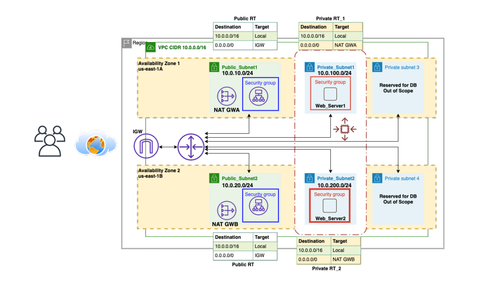
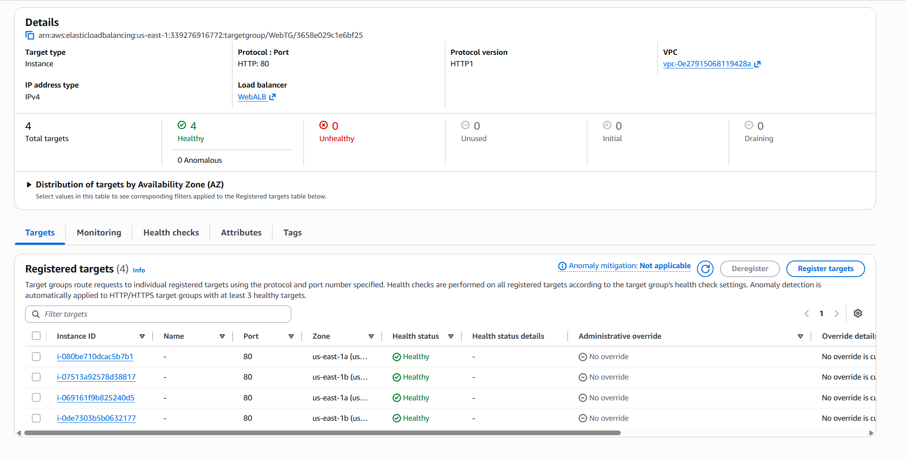
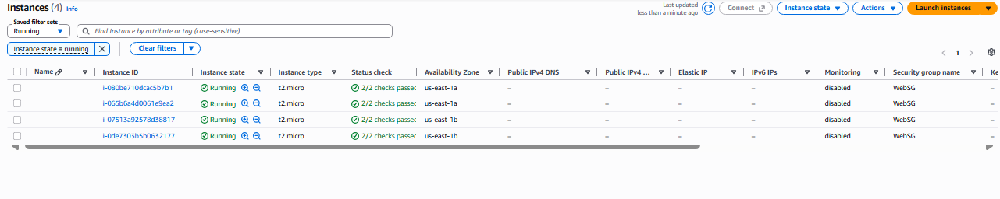

# 🚀 AWS Multi-Tier Web Architecture


> A highly available, fault-tolerant, auto-scaling web architecture deployed on AWS — built as a hands-on capstone project.

📅 **Completed:** September 2026

---

## 📌 Overview

This repository documents the design and deployment of a highly available, fault-tolerant web architecture on **Amazon Web Services (AWS)**. The infrastructure automatically scales compute capacity based on traffic demand while ensuring seamless load distribution across multiple Availability Zones (AZs).

This project was built to demonstrate practical, real-world AWS skills — covering custom VPC design, NAT routing, secure access with IAM/SSM, load balancing, and Auto Scaling.

---

## 🏗️ Architecture Diagram



The architecture spans **two Availability Zones**, each containing one public subnet and one private subnet. Public subnets host NAT Gateways and receive traffic from an Internet Gateway. Private subnets host the application servers, which are only reachable through the Application Load Balancer.

**Traffic flow**

- **Inbound:** Internet → Internet Gateway → Application Load Balancer (public subnets) → Target Group → EC2 web servers (private subnets)
- **Outbound:** EC2 (private) → NAT Gateway → Internet Gateway → Internet (OS updates and packages only)

Web servers have **no public IPs** — they are reachable only through the load balancer.

---

## ⚙️ Resources Built

| Layer | Resource | Details |
|---|---|---|
| Network | VPC | Custom network — `10.0.0.0/16` |
| Network | Subnets | Public + private subnets across **2 Availability Zones** |
| Network | Internet Gateway | Provides internet access to public subnet resources |
| Network | NAT Gateways ×2 | One per AZ — let private-subnet instances reach the internet without being exposed |
| Access | IAM Role (`ec2tossm`) | Grants SSM access — no SSH keys required |
| Compute | EC2 instances | Amazon Linux 2023, EBS-backed, Apache installed via user data |
| High availability | Application Load Balancer | `WebALB` — distributes HTTP traffic across all instances |
| High availability | Target Group | `WebTG` — performs health checks, routes only to healthy targets |
| High availability | Auto Scaling Group | `ASG` — maintains availability (min: 2, desired: 4, max: 6) |
| Security | Security Groups | `WebSG` (HTTP from ALB only), `ALBSG` (HTTP from anywhere) |

---

## 🎯 Key Features

- ✅ High availability across 2 Availability Zones
- ✅ Auto Scaling with health-check-based instance replacement
- ✅ Least-privilege security groups (`WebSG` only accepts traffic from `ALBSG`)
- ✅ Private subnets for backend servers — outbound-only internet access via NAT
- ✅ No SSH keys required — access handled securely through SSM
- ✅ Fault-tolerant web tier with zero single point of failure

---

## 🏗️ Build Phases

1. **VPC and subnets** — custom VPC (`10.0.0.0/16`) with public and private subnets across 2 AZs, Internet Gateway attached
2. **NAT Gateways** — one per Availability Zone so private-subnet instances get outbound-only internet access
3. **IAM + EC2** — `ec2tossm` IAM role for SSM access, EC2 instances launched into the private subnets with Apache bootstrapped via user data
4. **Load balancing** — `WebTG` target group with health checks, internet-facing `WebALB` spanning both public subnets
5. **Auto Scaling** — `ASG` (min 2 / desired 4 / max 6) attached to `WebTG`, replacing unhealthy or terminated instances automatically
6. **Security hardening** — `WebSG` inbound locked down to accept traffic only from `ALBSG`

---

## 🛠️ Bootstrapping Script (User Data)

Each instance is configured automatically on launch, installing and starting an Apache web server. Full script: [`scripts/user-data.sh`](scripts/user-data.sh)

```bash
#!/bin/bash
yum update -y
yum install httpd -y
systemctl start httpd
systemctl enable httpd
echo "This is an app server in AWS Region US-EAST-1" > /var/www/html/index.html
```

---

## 🧪 How It Was Tested

**1. Verified Apache was active on each instance** (via SSM Session Manager, no SSH key needed):
```bash
sudo systemctl status httpd
```

**2. Verified each instance served content locally:**
```bash
curl http://<instance-private-ip>
```

**3. Confirmed all targets in `WebTG` were Healthy:**



**4. Hit the ALB's DNS name repeatedly and confirmed traffic was load-balanced:**

| Request 1 — routed to server 2 | Request 2 (refreshed) — routed to server 1 |
|:---:|:---:|
|  |  |

Refreshing the page repeatedly shows requests landing on different instances — confirming the Application Load Balancer is distributing traffic correctly.

**5. Verified Auto Scaling replaced instances correctly** after terminating the originals, and new instances registered as healthy targets automatically:



---

## 🐞 Troubleshooting Log — the real learning

**Target group showing mixed health status (some instances Healthy, some not)**

- **Symptom:** After Auto Scaling replaced a terminated instance, the Target Group briefly showed some targets as `Healthy` and the new one as `Unhealthy`.
- **Diagnosis:** Checked the new instance directly — Apache was running fine and responding locally, so the service itself wasn't the problem. The instance had only just been launched by the ASG.
- **Root cause:** The new instance was still inside its health-check grace period — it needs to pass a required number of consecutive ALB health checks before the Target Group marks it `Healthy`, so a freshly launched instance is expected to show as unhealthy for a short window.
- **Fix:** No manual intervention needed — waited for the grace period and health-check interval to complete, and the instance flipped to `Healthy` on its own once it passed the required checks.
- **Lesson:** Don't treat a brand-new Auto Scaling instance as broken just because it starts out `Unhealthy` — check the grace period and health-check settings before troubleshooting the application itself.

---

## 🔒 Security Considerations

- `WebSG` allows inbound HTTP (80) **only from `ALBSG`** — instances are never reachable directly from the internet.
- `ALBSG` allows inbound HTTP (80) from any source, since the ALB is the intended public entry point.
- EC2 instances launch **without SSH key pairs** — all admin access goes through IAM-authenticated SSM sessions.
- Private subnets have no direct route to the Internet Gateway — all outbound traffic passes through NAT Gateways.

---

## 🧹 Cleanup

To avoid ongoing charges, resources should be removed in this order: Auto Scaling Group → Application Load Balancer → Target Group → NAT Gateways (release Elastic IPs) → EC2 instances → VPC.

---

## 🧠 Skills Demonstrated

VPC design · Multi-AZ high availability · NAT Gateway routing · Security group layering (least privilege) · IAM roles and SSM Session Manager (keyless access) · Application Load Balancer and target groups · Auto Scaling Groups and health checks · Real-world troubleshooting of health-check behavior

---

## 👤 Author

**Hamza Al-Akhter**
Computer Science Student — Taibah University

[](https://www.linkedin.com/in/hamza-alkthery-389614356/)
